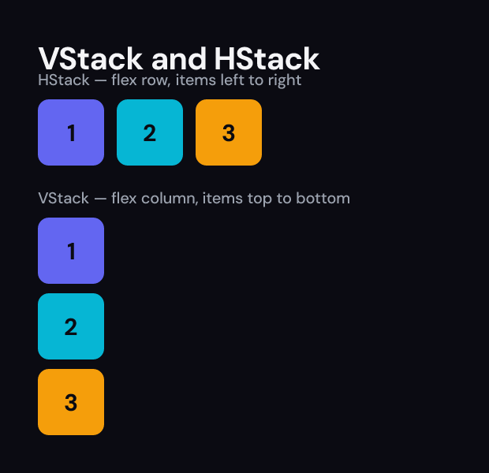

# og

Primitives for rendering Open Graph card images on Fetch-API edge runtimes. Each
product brings its own design — this package supplies the layout DSL and the
render plumbing, not a themed card.

It wraps a small image-rendering runtime dependency (`workers-og`) behind a
typed API: a declarative flex-box DSL for building card markup, plus helpers
for loading fonts, inlining assets as data URIs, and turning markup into a
cache-headered PNG response.

The main entry point (`@officialunofficial/og`) is pure JS with no runtime
dependencies — safe to import in a plain test environment. Render plumbing
that loads `workers-og` lives at the `@officialunofficial/og/render` subpath,
so code that only builds card markup (and its tests) never pays for it.

## Install

```sh
bun add @officialunofficial/og workers-og
```

`workers-og` is a peer dependency — you own the single copy that gets bundled
into your worker.

## Quick start

```ts
import { Text, VStack } from "@officialunofficial/og";
import { loadGoogleFonts, OG_HEIGHT, OG_WIDTH, renderOgImage } from "@officialunofficial/og/render";

export default {
  async fetch(request: Request): Promise<Response> {
    const title = new URL(request.url).searchParams.get("title") ?? "Hello";

    const html = VStack(
      { width: OG_WIDTH, height: OG_HEIGHT, padding: 60, backgroundColor: "#101014" },
      Text({ fontSize: 64, fontWeight: 700, color: "#fafafa" }, title),
    );

    const fonts = await loadGoogleFonts([{ family: "Inter", weight: 700 }]);
    return renderOgImage(html, { fonts });
  },
};
```

## Primitives

A tiny declarative layout DSL that emits the HTML string the renderer
consumes. Every box declares `display:flex` — the renderer rejects any `<div>`
with more than one child that doesn't, so this makes that class of bug
structurally impossible.



`HStack` and `VStack` are the same `Box` primitive with a different default
`flexDirection` — `HStack` lays children out left to right, `VStack` stacks
them top to bottom. The image above is rendered by **examples/worker**'s
`/diagram` route; regenerate it with `bun run dev` in that directory and
`curl -o docs/example.png http://localhost:8787/diagram`.

| Export   | What it is                                        |
| -------- | -------------------------------------------------- |
| `Box`    | A flex box with no implied direction.               |
| `VStack` | A flex column (`flex-direction: column`).           |
| `HStack` | A flex row, vertically centered by default.         |
| `Text`   | A text run that HTML-escapes its content for you.   |
| `Img`    | An image; `src` should already be a data URI.       |

Numeric style values get a `px` suffix, except for a small unitless set
(`flex`, `fontWeight`, `lineHeight`, `opacity`, `order`, `zIndex`,
`aspectRatio`) — the same convention CSS-in-JS libraries use. A caller-supplied
`display` on `Box` still wins over the enforced default.

## Helpers

From `@officialunofficial/og/render` (loads the `workers-og` renderer):

- `renderOgImage(html, options)` — renders card markup to a PNG `Response`
  with `Content-Type` and `Cache-Control` set. `options.scale` multiplies the
  pixel dimensions only; bake the same scale into your own font sizes and
  offsets.
- `loadGoogleFonts(specs)` — fetches font variants in parallel and shapes them
  for `renderOgImage`.
- `OG_WIDTH`/`OG_HEIGHT` — the standard 1200×630 card size in CSS pixels.

From `@officialunofficial/og` (pure JS, no renderer dependency):

- `svgToDataUri(svg)`/`toDataUri(mimeType, data)` — inline assets as data
  URIs. The renderer can't fetch remote images on these runtimes, so every
  image needs to already be a data URI.
- `stopColors(svg)` — extracts `stop-color` values from an SVG in document
  order, so a card can derive an accent palette straight from a logo.
- `truncate(text, max)` — caps text on a word boundary with an ellipsis.

## Example

A brand-neutral, fully working worker lives in **examples/worker/**:

```sh
bun run build
cd examples/worker
bun link @officialunofficial/og
bun install
bun run dev
```

## Development

```sh
bun install
bun run check   # lint, format, typecheck, test, build, and package-shape checks
```

Releases are automated by [release-please](https://github.com/googleapis/release-please):
every merged commit updates a standing release pull request with the next
version and changelog entry, computed from [Conventional
Commits](https://www.conventionalcommits.org/). Merging that pull request tags
and publishes a release, which runs the npm publish job in the same workflow
run. Nobody hand-bumps `version` or writes **CHANGELOG.md** entries.

This requires a one-time repo setup: a fine-grained personal access token
scoped to this repo (`Contents: write`, `Pull requests: write`), stored as the
`RELEASE_PLEASE_TOKEN` secret. The org blocks the default `GITHUB_TOKEN` from
creating pull requests, and even without that restriction, a `GITHUB_TOKEN`-
authored release doesn't trigger other workflow runs — the PAT sidesteps both.

## License

Dual-licensed under [MIT](LICENSE-MIT) or [Apache-2.0](LICENSE-APACHE), at
your option.
